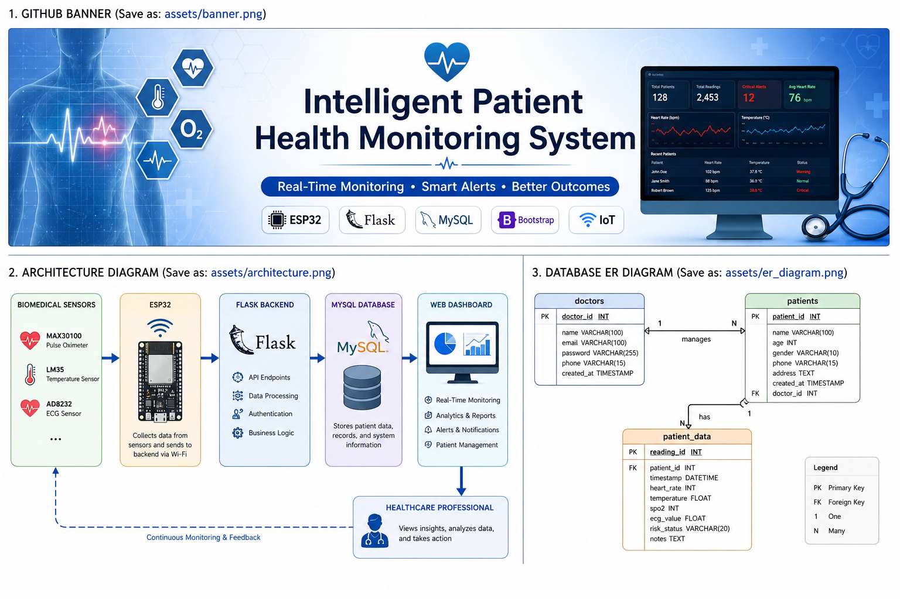
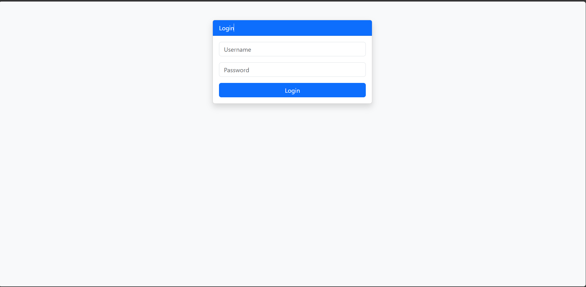
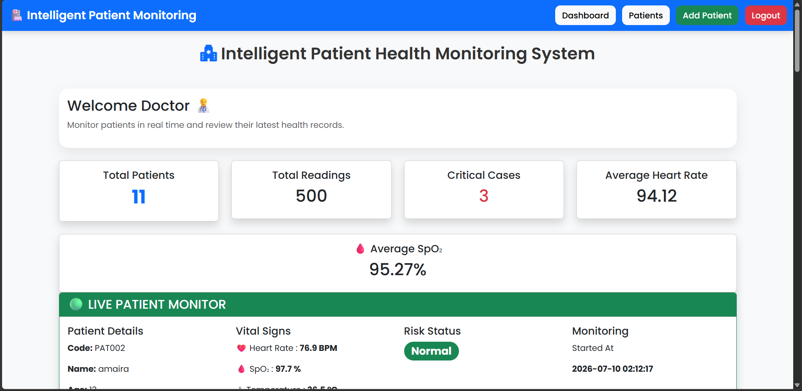
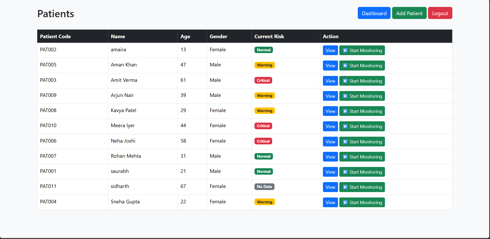
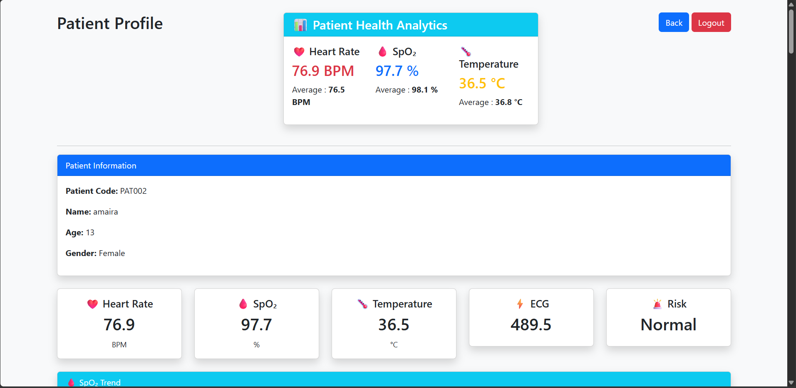
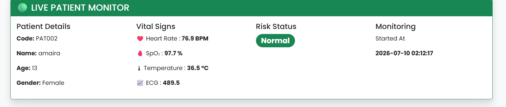
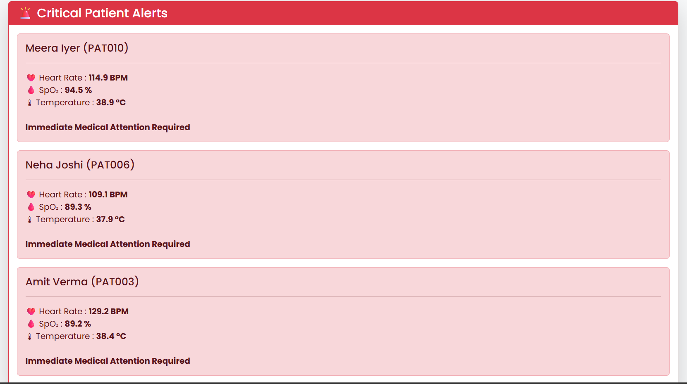

<p align="center">
  
</p>

<h1 align="center">🏥 Intelligent Patient Health Monitoring System</h1>

<p align="center">
An IoT-enabled Healthcare Monitoring Platform using <strong>ESP32</strong>, <strong>Flask</strong>, <strong>MySQL</strong>, and <strong>Bootstrap</strong>.
</p>


<p align="center">

An IoT-enabled Healthcare Monitoring Platform built using **ESP32**, **Flask**, **MySQL**, and **Bootstrap**.

</p>

---

<p align="center">
⭐ If you like this project, consider giving it a star on GitHub!
</p>

An IoT-enabled healthcare monitoring platform developed using **ESP32**, **Flask**, and **MySQL** to monitor patient vital signs in real time. The system provides healthcare professionals with an interactive dashboard for patient management, live monitoring, health summaries, priority-based patient queues, and critical alerts, enabling faster and more informed clinical decisions.

---
## 🚧 Project Status

**Status:** Active Development

Current Version: **v1.0**

## 📌 Overview

The Intelligent Patient Health Monitoring System is designed to assist healthcare professionals by continuously monitoring patient vital signs and presenting them through an intuitive web dashboard.

The project combines **IoT**, **Embedded Systems**, **Web Development**, and **Database Management** to create an efficient patient monitoring platform.

---
## 🎯 Objectives

- Monitor patient vital signs in real time.
- Provide an interactive dashboard for healthcare professionals.
- Detect abnormal health conditions.
- Prioritize patients based on risk.
- Improve healthcare monitoring through IoT.

## 📦 Modules

- Authentication
- Dashboard
- Patient Management
- Live Monitoring
- Health Summary
- Priority Queue
- Critical Alerts
- Reports


## Key Features
| Feature | Status |
|---------|--------|
| Doctor Login | ✅ |
| Dashboard | ✅ |
| Patient Management | ✅ |
| Live Monitoring | ✅ |
| Health Summary | ✅ |
| Priority Queue | ✅ |
| Critical Alerts | ✅ |
| ESP32 Integration | ✅ |
| AI Clinical Decision Support | 🚧 |
| PDF Reports | 🚧 |

## 🛠️ Tech Stack

| Category | Technologies |
|----------|--------------|
| Backend | Python, Flask |
| Frontend | HTML5, CSS3, Bootstrap 5, JavaScript |
| Database | MySQL |
| Charts | Chart.js |
| Hardware | ESP32, MAX30100, LM35, AD8232 |

## 📂 Project Structure

```text
AI-Patient-Health-Monitoring-System/
│
├── app.py
├── config.py
├── database.py
├── requirements.txt
├── README.md
├── .gitignore
│
├── routes/
│   ├── auth.py
│   ├── dashboard.py
│   ├── monitoring.py
│   ├── patients.py
│   ├── reports.py
│
├── templates/
│
├── static/
│   ├── css/
│   ├── js/
│   └── images/
│
└── esp32/
```

---

## 🏗️ System Architecture


---

## 🚀 Installation

### 1. Clone the Repository

```bash
git clone https://github.com/saytooyum/AI-Patient-Health-Monitoring-System.git
```

### 2. Navigate to the Project Folder

```bash
cd AI-Patient-Health-Monitoring-System
```

### 3. Create a Virtual Environment

```bash
python -m venv venv
```

### 4. Activate the Virtual Environment

**Windows**

```bash
venv\Scripts\activate
```

**Linux/macOS**

```bash
source venv/bin/activate
```

### 5. Install Required Packages

```bash
pip install -r requirements.txt
```

### 6. Configure the Database

Create a MySQL database and update your database credentials inside `config.py`.

### 7. Run the Application

```bash
python app.py
```

Open your browser and visit:

```
http://127.0.0.1:5000
```

---

## 📷 Application Screenshots

### 🔐 Login Page



---

### 📊 Dashboard



---

### 👥 Patient Management



---

### ❤️ Patient Profile



---

### 📈 Live Patient Monitoring



---

### 🚨 Critical Patient Alerts




## 🔮 Future Enhancements

- 🤖 AI Clinical Decision Support
- 📄 Automated PDF Medical Reports
- 📧 Email Notification System
- 📱 Mobile Application
- ☁️ Cloud Deployment
- 📡 Live ESP32 Sensor Streaming
- 🧠 Predictive Health Analytics
- 🔍 Advanced Patient Search & Filtering
---
## 🎥 Demo

Coming Soon

A complete demonstration video of the application will be available here.

## 🤝 Contributing

Contributions are welcome! Feel free to fork the repository and submit pull requests to improve the project.

---

## 👨‍💻 Author

**Satyam Raina**

B.Tech Computer Science & Engineering

---

## ⭐ Support

If you found this project useful, please consider giving it a ⭐ on GitHub.

---

## 📄 License

This project is licensed under the MIT License.